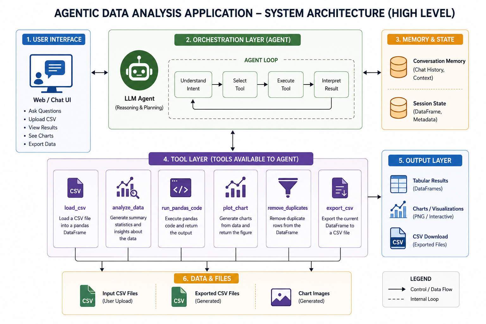

<div align="center">
  <br />
  <h1 align="center">DataSense AI</h1>
  <p align="center">
    <strong>Intelligent Data Analysis Agent powered by Google Gemini 3.8 Flash & Streamlit</strong>
    <br />
    <br />
    <a href="https://www.python.org/downloads/"></a>
    <a href="https://streamlit.io"></a>
    <a href="https://aistudio.google.com/"></a>
    <a href="https://opensource.org/licenses/MIT"></a>
  </p>
  <p align="center">
    <a href="https://data-analyst-agent-125.streamlit.app/"></a>
  </p>
  <p align="center">
    <em>Upload any CSV — ask questions in natural language — get instant analysis, charts, and actionable insights.</em>
  </p>
  <br />
</div>

<hr />

## Features

<dl>
  <dt><strong>Autonomous Agent</strong></dt>
  <dd>Powered by Gemini 3.8 Flash, the agent automatically decides which data tools to use based on your question. It handles the logic so you can focus on the results.</dd>

  <dt><strong>Real-Time Streaming</strong></dt>
  <dd>Watch the agent's thought process as it executes tools via animated step indicators, and read the response as it streams word-by-word.</dd>

  <dt><strong>Auto-Visualization</strong></dt>
  <dd>Ask for a chart, and the agent writes the pandas code, plots it, and renders the image directly in the chat interface.</dd>

  <dt><strong>Premium UI/UX</strong></dt>
  <dd>A stunning dark glassmorphism design featuring custom gradients, interactive hover states, and dynamic typography.</dd>

  <dt><strong>Data Cleaning & Export</strong></dt>
  <dd>Easily find missing values, remove duplicates, and export the cleaned dataset back to a CSV format.</dd>
</dl>

<br />

## Available Capabilities

The agent is equipped with a highly specific set of tools to handle your data securely and efficiently:

| Tool | Capability | Description |
| :--- | :--- | :--- |
| `load_csv` | **Ingestion** | Safely loads your uploaded CSV into memory for analysis. |
| `analyze_data` | **Exploratory** | Generates a full EDA report (row counts, nulls, duplicates, correlations). |
| `run_pandas_code` | **Execution** | Securely runs agent-generated pandas code to filter, group, or transform data. |
| `plot_chart` | **Visualization** | Creates custom Bar, Line, Scatter, Histogram, or Pie charts. |
| `remove_duplicates` | **Cleaning** | Cleans the active dataset by dropping duplicate rows. |
| `export_csv` | **Extraction** | Saves the current state of the dataset and provides a download button. |

<br />

## Quick Start (Local Setup)

### Prerequisites
* Python 3.10+
* A Google Gemini API key ([Get one free here](https://aistudio.google.com/))

### 1. Clone the repository
```bash
git clone https://github.com/yourusername/datasense-ai.git
cd datasense-ai
```

### 2. Set up a virtual environment
```bash
python -m venv venv

# Windows
venv\Scripts\activate
# macOS/Linux
source venv/bin/activate
```

### 3. Install dependencies
```bash
pip install -r requirements.txt
```

### 4. Configure Environment Variables
Create a `.env` file in the root directory and add your Gemini API key:
```env
GEMINI=your_google_ai_studio_api_key_here
```

### 5. Run the application
```bash
streamlit run app.py
```
> The application will automatically open in your default browser at `http://localhost:8501`.

<br />

## Architecture

<div align="center">
  
</div>

<br />

## Contributing

Contributions, issues, and feature requests are welcome! Feel free to check the [issues page](https://github.com/yourusername/datasense-ai/issues).

1. Fork the Project
2. Create your Feature Branch (`git checkout -b feature/AmazingFeature`)
3. Commit your Changes (`git commit -m 'Add some AmazingFeature'`)
4. Push to the Branch (`git push origin feature/AmazingFeature`)
5. Open a Pull Request

<br />
<hr />

<div align="center">
  <p>Built with precision using Streamlit & Google Gemini</p>
</div>
